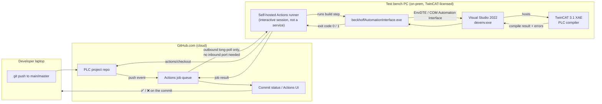

# PLC CI Compile Pipeline — Setup Guide

Step-by-step instructions to stand up an automatic "does the PLC project still
compile?" check on every push to `main`/`master`, running on the test bench
machine you already have TwinCAT/Visual Studio licensed on.

**Where things live:**
- This guide's *commands* run on the **test bench PC** (Windows, on-prem, the
  machine with the node-locked TwinCAT license).
- The **workflow YAML** (Step 5) goes into the **PLC project's own GitHub
  repo** — the one with `.tsproj`/`.plcproj`/`.sln` checked in. It is a
  *different* repo from this tool's repo.
- The **tool** (`beckhoffAutomationInterface.exe`) is built once from *this*
  repo and lives on the bench PC as a fixed local path the workflow calls into.

Related: [docs/ideas/plc-ci-compile-pipeline.md](ideas/plc-ci-compile-pipeline.md)
for the reasoning behind this design (why self-hosted, why no cloud runner,
what's explicitly deferred).

---

## 1. Architecture

### 1.1 Components and where they run



### 1.2 Who calls whom, in order

```mermaid
sequenceDiagram
    participant Dev as Developer
    participant GH as GitHub (cloud)
    participant Runner as Self-hosted runner (bench PC)
    participant Tool as beckhoffAutomationInterface.exe
    participant VS as Visual Studio (devenv.exe, via COM)
    participant TC as TwinCAT XAE compiler

    Dev->>GH: git push origin main
    GH->>GH: workflow triggered (on push to main/master)
    GH-->>Runner: job dispatched (runner polls GitHub — no inbound connection)
    Runner->>GH: actions/checkout@v4 (pulls the pushed commit)
    Runner->>Tool: beckhoffAutomationInterface.exe build &lt;path&gt; [--plc-name ...]
    Tool->>VS: open project via VisualStudio.DTE.17.0 (COM)
    VS->>TC: Rebuild PLC project
    TC-->>VS: compile result + error list
    VS-->>Tool: build events / errors
    Tool-->>Runner: process exit code (0 = pass, 1 = fail)
    Runner-->>GH: step/job result
    GH-->>Dev: commit status shows pass/fail
```

### 1.3 Why a plain Windows *service* won't work here

Visual Studio's automation API (`EnvDTE`/COM `DTE`) expects an interactive
desktop session — it's the same reason this tool's own troubleshooting notes
mention a lingering `devenv.exe` after a crash. A GitHub Actions runner
installed the normal way (`svc.cmd install`) runs as a Windows service in
**Session 0**, which has no desktop. Opening Visual Studio from there
typically fails or hangs.

**Fix:** run the runner *interactively*, in a real logged-on desktop session,
started automatically at boot via autologon + Task Scheduler (Step 4) —
not as a `NT SERVICE`. This is a one-time setup quirk, not something you'll
touch again after it's working.

---

## 2. Prerequisites check (bench PC)

You said everything is already installed here — this is just a fast sanity
check before wiring CI on top of it, reusing the verification commands from
[`beckhoffAutomationInterface/REQUIREMENTS.md`](../beckhoffAutomationInterface/REQUIREMENTS.md).

Open **PowerShell** on the bench PC:

```powershell
# .NET SDK
dotnet --version        # expect 6.0 or later

# Visual Studio 2022 present
Test-Path "C:\Program Files\Microsoft Visual Studio\2022\Community\Common7\IDE\devenv.exe"
# expect: True   (path may differ slightly for Professional/Enterprise)

# VS DTE COM registration
$clsid = (Get-ItemProperty "HKLM:\SOFTWARE\Classes\VisualStudio.DTE.17.0\CLSID")."(default)"
(Get-ItemProperty "HKLM:\SOFTWARE\Classes\CLSID\$clsid\LocalServer32")."(default)"
# expect: path to devenv.exe

# TwinCAT XAE project template present
Test-Path "C:\Program Files (x86)\Beckhoff\TwinCAT\3.1\Components\Base\PrjTemplate\TwinCAT Project.tsproj"
# expect: True

# Git available
git --version
```

If any of these fail, fix that first — see `REQUIREMENTS.md` section 7
("Common Errors & Fixes") before continuing.

---

## 3. Build the tool once on the bench PC

```powershell
# Clone this tool's repo somewhere fixed and out of the way
git clone https://github.com/<your-org>/beckhoffAutomationInterface.git C:\tools\beckhoffAutomationInterface

cd C:\tools\beckhoffAutomationInterface\beckhoffAutomationInterface
dotnet build -c Debug -f net48
```

The executable ends up at:

```
C:\tools\beckhoffAutomationInterface\beckhoffAutomationInterface\bin\Debug\net48\beckhoffAutomationInterface.exe
```

This path is fixed and referenced directly from the CI workflow in Step 5 —
the workflow does **not** rebuild this tool on every run.

> To pick up a newer version of this tool later: `git pull` in
> `C:\tools\beckhoffAutomationInterface`, then `dotnet build` again. No CI
> changes needed since the path stays the same.

---

## 4. Validate a manual build against the real PLC project

Do this once, by hand, **before** wiring up CI — it proves the whole chain
(tool → COM → Visual Studio → TwinCAT) works against your *actual* project,
not just the bundled sample.

### 4.1 Get the PLC project onto the bench PC

```powershell
git clone https://github.com/<your-org>/<plc-project-repo>.git C:\ci\plc-checkout
```

### 4.2 Run the build, read-only

The `build` command's positional path can point straight at the checked-out
repo root — it finds the single `.tsproj` nested inside automatically (as
long as there's only one; it errors with all candidates listed if there's
more than one, rather than guessing):

```powershell
cd C:\tools\beckhoffAutomationInterface\beckhoffAutomationInterface\bin\Debug\net48

.\beckhoffAutomationInterface.exe build "C:\ci\plc-checkout"

echo "Exit code: $LASTEXITCODE"
# 0 = BUILD PASSED, 1 = failed or timed out
```

If that fails with an error about the PLC project name, the `.tsproj`
file's own name doesn't match what's registered inside `TIPC` — find the
real one and pass it explicitly:

```powershell
Get-ChildItem -Recurse -Filter *.plcproj -Path "C:\ci\plc-checkout" | Select-Object FullName
# --plc-name = that .plcproj file's name WITHOUT the extension

.\beckhoffAutomationInterface.exe build "C:\ci\plc-checkout" --plc-name "<RealPlcName>"
```

This mode never calls `Project.Save()`/`Solution.SaveAs()` — it's safe to
run against the real project without risk of modifying it. If this step
doesn't come back `0` (or errors before reaching a build result at all), fix
that here before touching GitHub Actions — CI will hit the exact same
failure.

---

## 5. Install the GitHub Actions self-hosted runner

Do this in the **PLC project repo** on GitHub (not this tool's repo):

1. Open the PLC repo → **Settings → Actions → Runners → New self-hosted runner**.
2. Choose **Windows**, **x64**.
3. GitHub shows you a download + configure script *with a one-time
   registration token already filled in*. Copy those exact commands — the
   version number and token below are illustrative placeholders and will be
   different (and expire) for you:

```powershell
mkdir C:\actions-runner
cd C:\actions-runner

# --- copy the exact Invoke-WebRequest URL/version GitHub shows you ---
Invoke-WebRequest -Uri https://github.com/actions/runner/releases/download/v2.<VERSION>/actions-runner-win-x64-2.<VERSION>.zip -OutFile actions-runner-win-x64.zip
Add-Type -AssemblyName System.IO.Compression.FileSystem
[System.IO.Compression.ZipFile]::ExtractToDirectory("$PWD\actions-runner-win-x64.zip", "$PWD")

# --- copy the exact --url/--token GitHub shows you ---
.\config.cmd --url https://github.com/<your-org>/<plc-project-repo> --token <REGISTRATION_TOKEN>
```

During `config.cmd`, accept the defaults for runner name/labels unless you
have a reason to change them (default labels include `self-hosted`,
`Windows`, `X64` — the workflow in Step 6 targets those).

**Do not run `svc.cmd install` here** — see section 1.3. Continue to Step 4
instead, which starts the runner interactively.

---

## 6. Run the runner interactively (autologon + Task Scheduler)

This makes the bench PC boot straight into a real desktop session and start
the runner automatically, without anyone physically logging in — required so
Visual Studio's COM automation has a desktop to attach to.

> **Which account?** Ideally a dedicated, low-privilege local account (e.g.
> `ci-runner`), not a real person's domain account. In practice, if you ran
> `config.cmd` from inside `C:\Users\Administrator\actions-runner` (its
> default working directory when launched from an Administrator session),
> the runner folder now lives inside that account's own profile — a
> separate low-privilege account won't have permission to reach into it
> without extra ACL changes. The steps below use `Administrator` directly
> to match that common case; substitute your actual account name and runner
> path throughout if different. Trade-off either way: storing an autologon
> password is a real, if small, exposure — keep the bench PC physically
> secured, and if you do create a separate account, don't reuse a
> privileged credential for it.

### 6.1 (Optional) Create a dedicated local account instead of using Administrator

Skip this if you're using `Administrator` (see note above). Only do this if
you first move the runner folder to a neutral path (e.g. `Move-Item
C:\Users\Administrator\actions-runner C:\actions-runner`) so the new account
can actually reach it:

```powershell
# Run as Administrator
$password = Read-Host -AsSecureString "Set password for ci-runner"
New-LocalUser -Name "ci-runner" -Password $password -PasswordNeverExpires -Description "GitHub Actions runner account"
Add-LocalGroupMember -Group "Users" -Member "ci-runner"
```

### 6.2 Configure autologon for that account

```powershell
# Run as Administrator — replace "Administrator" with "ci-runner" if you did 6.1
$regPath = "HKLM:\SOFTWARE\Microsoft\Windows NT\CurrentVersion\Winlogon"
Set-ItemProperty -Path $regPath -Name "AutoAdminLogon" -Value "1"
Set-ItemProperty -Path $regPath -Name "DefaultUserName" -Value "Administrator"
Set-ItemProperty -Path $regPath -Name "DefaultPassword" -Value "<that account's real password>"
```

(Microsoft's Sysinternals **Autologon.exe** does the same thing but stores
the password as an encrypted LSA secret instead of a plaintext registry
value — worth using instead if you want to avoid the plaintext value above.)

### 6.3 Start the runner at logon via Task Scheduler

```powershell
# Run as Administrator — adjust the path/user if you did 6.1 or your
# runner folder isn't at this exact location (check with `dir` first)
$action = New-ScheduledTaskAction -Execute "C:\Users\Administrator\actions-runner\run.cmd"
$trigger = New-ScheduledTaskTrigger -AtLogOn -User "Administrator"
$principal = New-ScheduledTaskPrincipal -UserId "Administrator" -LogonType Interactive -RunLevel Highest
Register-ScheduledTask -TaskName "GitHubActionsRunner" -Action $action -Trigger $trigger -Principal $principal
```

### 6.4 Reboot and confirm

```powershell
Restart-Computer
```

After reboot, the machine should auto-log into that account and a console
window running `run.cmd` should appear, ending with `Listening for Jobs`. On
GitHub, **Settings → Actions → Runners** should show the runner as **Idle**
(green dot).

---

## 7. Add the workflow to the PLC project repo

In the **PLC project repo** (not this one), add:

`.github/workflows/plc-build.yml`

```yaml
name: PLC Build

on:
  push:
    branches: [main, master]

jobs:
  build:
    runs-on: [self-hosted, Windows, X64]
    steps:
      - name: Checkout PLC project
        uses: actions/checkout@v4

      - name: Compile PLC project
        shell: powershell
        run: |
          $tool = "C:\tools\beckhoffAutomationInterface\beckhoffAutomationInterface\bin\Debug\net48\beckhoffAutomationInterface.exe"
          $plcName = "<RealPlcName>"   # from Step 4.2 — omit --plc-name entirely if not needed

          & $tool build "$env:GITHUB_WORKSPACE" --plc-name $plcName
          if ($LASTEXITCODE -ne 0) {
            throw "PLC build failed (exit code $LASTEXITCODE)"
          }
```

Pointing `build` at `$env:GITHUB_WORKSPACE` (the whole checked-out repo) is
safe even without hardcoding the exact `.tsproj` path — the tool errors out
(exit 1, listing every candidate) rather than silently guessing if the repo
ever gains a second `.tsproj` (e.g. a sample or scratch project), so this
stays deterministic without needing the path spelled out.

Commit and push this file to `main`/`master` — that push itself will trigger
the very first CI run.

---

## 8. Verify end-to-end

1. On GitHub: **PLC repo → Actions tab** — you should see the "PLC Build"
   workflow running, picked up by your runner.
2. Watch the log — it should show `actions/checkout`, then the tool opening
   Visual Studio (this takes a minute or two, same as the manual run in
   Step 4.2), then a build result.
3. On success: green check on the commit. On failure: red X, with the
   compile errors visible in the step log.
4. To prove the failure path works, deliberately break the PLC project
   (e.g. a syntax error in one POU), push it, and confirm the job goes red
   with a useful error message — then revert.

---

## 9. Troubleshooting

| Symptom | Likely cause | Fix |
|---|---|---|
| Runner shows **Offline** on GitHub | The autologon account's desktop session isn't running, or `run.cmd` crashed | RDP/console into the bench PC as that account, check the console window; re-run Step 6.3/6.4 |
| Job hangs, never completes | `devenv.exe` opened but has no desktop to render to (runner ended up running as a service after all) | Confirm no `NT SERVICE\...` runner service is installed (`Get-Service *actions*`); use the Task Scheduler approach only |
| `REGDB_E_CLASSNOTREG (0x80040154)` | Running the tool as x86 instead of x64 | Shouldn't happen if you built from this repo unmodified — see `REQUIREMENTS.md` §7 |
| Stray `devenv.exe` left running after a failed/interrupted job | Known behavior — the tool's own README documents this | `Get-Process devenv \| Stop-Process -Force` on the bench PC, then re-run |
| Build passes locally (Step 4.2) but fails in CI | Path differences — CI checks out to `$env:GITHUB_WORKSPACE`, a different folder than your manual `C:\ci\plc-checkout` | Both point `build` at the repo root, so this should be rare; if it happens, confirm the checked-out repo's internal folder structure matches what you tested manually |
| `RPC_E_SERVERCALL_RETRYLATER` / random COM errors | Usually a lingering `devenv.exe` from a previous run | Kill stray `devenv.exe` processes, retry |

---

## 10. Rollback / uninstall

If you need to remove the runner (e.g. reassigning the bench PC):

```powershell
# On the bench PC
cd C:\actions-runner
.\config.cmd remove --token <REMOVAL_TOKEN>   # get this token from the same GitHub Runners settings page

# Undo autologon
Remove-ItemProperty -Path "HKLM:\SOFTWARE\Microsoft\Windows NT\CurrentVersion\Winlogon" -Name "AutoAdminLogon","DefaultPassword" -ErrorAction SilentlyContinue

# Remove the scheduled task
Unregister-ScheduledTask -TaskName "GitHubActionsRunner" -Confirm:$false
```

---

## 11. What's deliberately NOT covered here

Per [docs/ideas/plc-ci-compile-pipeline.md](ideas/plc-ci-compile-pipeline.md):
required/blocking PR checks, multi-project build matrices, Slack/email
notifications, concurrency guarding between overlapping pushes, and running
actual tests or hardware-in-the-loop. Revisit those once this simple version
has been running reliably for a few weeks.
